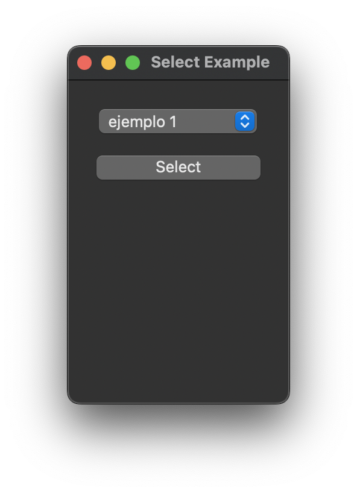
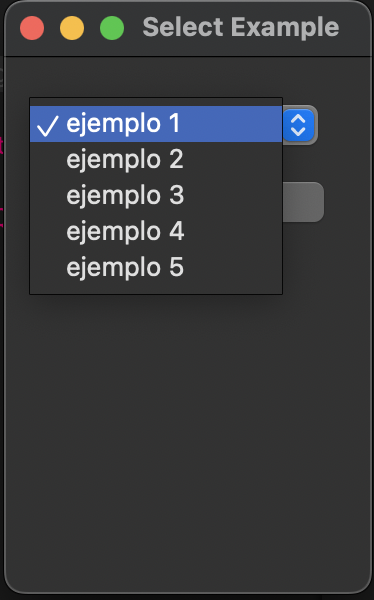
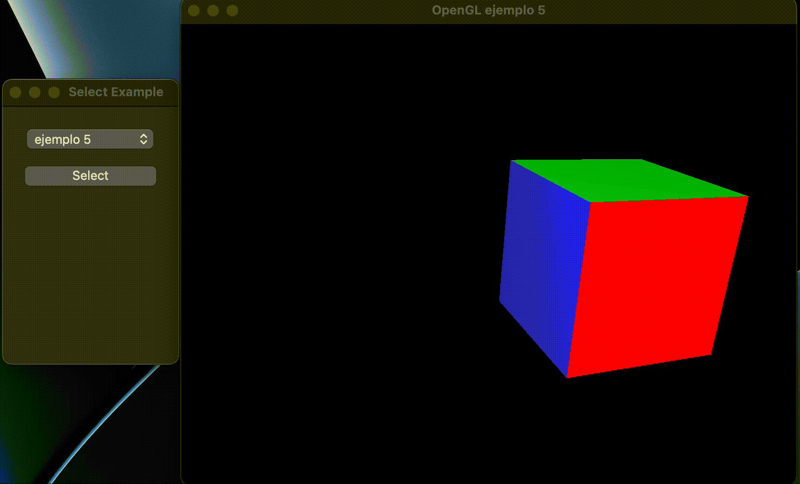

# QTViewport for OpenGL

A simple QT viewport for OpenGL

## Requirements

* g++ or clang++
* Qt >= 5 [^1]
* qmake
* OpenGL

## Instructions

Clone the repo

```sh
git clone https://github.com/EMACC99/QTViewport_OpenGL
```

Then change to the folder repo with

```sh
cd QTViewport_OpenGL
```

### Compilation

To compile just run

```sh
qmake
```

then

```sh
make
```

This will generate an executable named `openglwindow` on Linux or `openglwindow.app` on Mac.

### Run

* #### Linux

    ```sh
    ./openglwindow
    ```

* #### Mac

    ```sh
    open openglwindow.app
    ```

    Or

    ```sh
    ./openglwindow
    ```

    If `CONFIG -= app_bundle` is uncommented on the `.pro` file.

## Intercactions

Currently the only intercations provided are:

* `W`: Rotate up the object
* `A`: Rotate left
* `S`: Rotate down
* `D`: Rotate right
* `R`: Auto rotate

Currently, the only things that have this intercations are `ejemplo 4` and `ejemplo 5`

## Interface

To run something, just select it from the drop down.






[^1]: For QT6, change the line in `select_example.hpp` from
    `#include <QtWidgets/QAction>` to
    `#include <QtGui/QAction>` and add `QT += openglwidgets` to the `.pro` file
